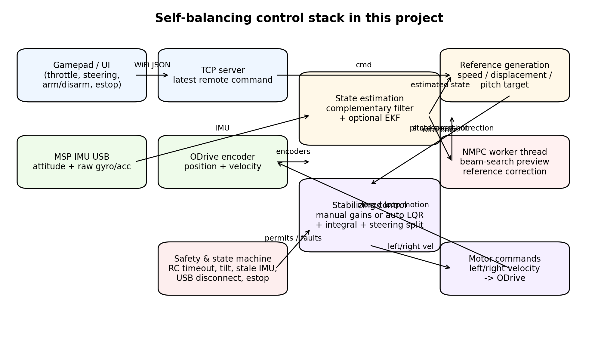
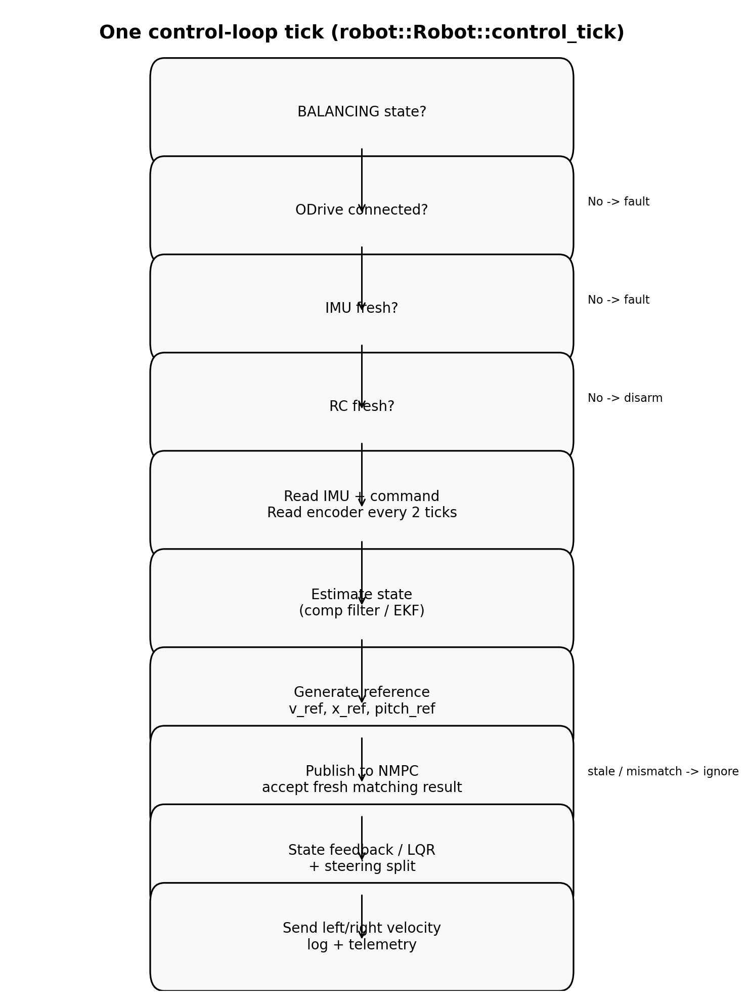
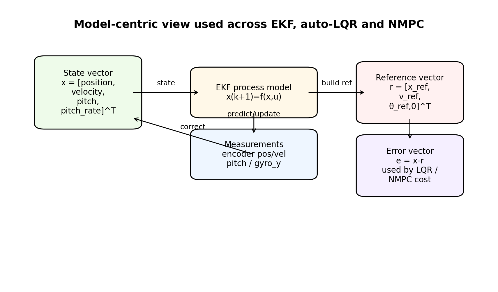
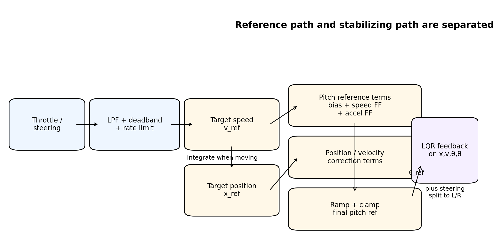

# 平衡控制算法全量 Code Review 与原理拆解

> 目标：把这个工程里和平衡控制相关的**代码结构、控制原理、执行逻辑、数据流、状态机、安全链路、主要风险点**一次讲清楚，让你可以不靠“猜参数”，而是从代码本身完整理解系统。

---

## 1. 这份审阅覆盖了什么

本次不是只看 `balance_controller.cpp`，而是按“整条控制链”通读：

- **robot 侧闭环核心**
  - `robot/src/robot.cpp`
  - `robot/src/balance_controller.cpp`
  - `robot/src/ekf.cpp`
  - `robot/src/control_model.cpp`
  - `robot/src/nmpc_controller.cpp`
  - `robot/src/tcp_server.cpp`
  - `robot/src/odrive_usb.cpp`
  - `robot/src/msp_imu_usb.cpp`
  - `robot/src/logger.cpp`
- **controller 侧上位机 / 遥控端**
  - `controller/src/main.cpp`
  - `controller/src/hud_renderer.cpp`
  - `controller/src/config_persistence.cpp`
  - `controller/include/*.h`
- **公共与辅助模块**
  - `common/mini_json.h`
  - `robot/tests/test_json_config.cpp`
  - `tools/replay_csv.py`
- **现有文档**
  - `Doc/00~08_*.md`

结论先说：

1. 这个工程的平衡控制不是“单个 PID”。
2. 它是一个**分层闭环**：**状态估计 → 参考生成 → NMPC 参考修正 → LQR/状态反馈稳定 → 差速执行 → 安全保护**。
3. 代码里还保留了 `legacy_*_pid_` 变量，但**当前主稳定路径已经不是传统串级 PID 主导**，而是以 **LQR 风格状态反馈** 为主，NMPC 做参考修正。

---

## 2. 先用一张图看全系统



这张图对应代码里的真实层级：

- 遥控器通过 TCP 发 `throttle / steering / arm / disarm / estop`
- IMU 通过 MSP USB 提供姿态、陀螺仪、加速度
- ODrive 提供编码器位移和速度，并接收左右轮速度命令
- `BalanceController` 做状态估计、参考生成、状态反馈
- `NmpcController` 在后台线程里做参考优化，结果只在**新鲜且上下文匹配**时才会被采纳
- `Robot` 负责整个状态机、安全策略、线程与设备管理

---

## 3. 这个系统到底在控什么

代码里统一的核心状态是 4 维：

```text
x = [position, velocity, pitch, pitch_rate]^T
```

对应 `robot/include/types.h` 里的 `EstimatedState`：

- `displacement_turns`：平均轮位移，单位 turns
- `velocity_tps`：平均轮速，单位 turns/s
- `pitch_deg`：俯仰角，单位 deg
- `pitch_rate_dps`：俯仰角速度，单位 deg/s

直觉上可以这样理解：

- **pitch / pitch_rate** 决定“会不会倒”
- **position / velocity** 决定“有没有跑飞、是否跟随速度命令、是否能停稳”

所以它不是只控角度，而是同时控：

- 车身角度稳定
- 轮速跟踪
- 长时间位置漂移抑制

这就是为什么代码里会同时出现：

- `theta_error`
- `theta_d_error`
- `x_error`
- `v_error`

而不是只有一个 `pitch_error`。

---

## 4. 主循环是怎么跑起来的

### 4.1 顶层运行流程

`robot/src/robot.cpp::run()` 做的事情是：

1. 启动 telemetry 线程
2. 启动 reconnect 线程
3. 进入固定频率控制循环（默认 `control_rate_hz = 200`）
4. 每个 tick：
   - 处理 arm/disarm/estop 请求
   - 调 `control_tick(dt)`
5. 退出时按顺序清理：停电机、停 IMU、等后台线程退出、停 logger、停 TCP、detach USB、关闭 libusb

### 4.2 单次 control tick 的真实路径



对应 `Robot::control_tick(double dt)`：

1. 只有 `BALANCING` 状态才进入闭环
2. 检查 ODrive 是否仍连接
3. 检查 IMU 数据是否新鲜
4. 检查遥控命令是否超时
5. 读取 IMU、遥控命令、编码器位置/速度
6. 把编码器状态送进 `BalanceController`
7. 调 `controller_.update(imu, cmd, dt)`
8. 再做一次倾倒安全检查
9. 把左右轮目标速度发给 ODrive
10. 记录日志与调试数据

也就是说，真正的控制律入口只有一个：

```cpp
MotorOutput output = controller_.update(imu_data, cmd, dt);
```

---

## 5. 状态机和安全边界

`Robot` 这一层不是数学控制器，而是**工程守门员**。

它要保证：

- 设备没连好，绝不进入平衡
- IMU stale，立即 fault
- 遥控掉线，立即 disarm
- 急停命令，立即 fault
- 倾角超阈值，立即 fault
- USB 热插拔断开时，退出平衡并回到等待状态

这层逻辑非常关键，因为再好的控制律也怕：

- 传感器卡死
- 电机掉线
- TCP 丢包
- 用户松手后没有命令输入

### 5.1 当前安全策略的优点

- RC timeout 有保护
- IMU freshness 有保护
- USB detach 有保护
- estop 单独走 fault
- ODrive 在 fault/shutdown 时 best-effort 停车

### 5.2 当前安全策略的一个现实结论

这套系统的“安全”主要依赖：

- **软件状态机是否及时发现异常**
- **ODrive 速度模式能否及时接受 0 速度 / idle 命令**

因此，底层通信阻塞会直接影响停机体验。这也是你之前遇到“退出卡住”的根源方向之一。

---

## 6. 传感器与状态估计：为什么不是直接拿 IMU pitch 就控

### 6.1 IMU 输入来自两路信息

在 `balance_controller.cpp::estimate_state()` 里，俯仰角来源不是单一值，而是三层融合：

1. 用加速度计算静态几何俯仰角：

```text
acc_pitch = atan2(-ax, sqrt(ay^2 + az^2))
```

2. 用互补滤波融合：

```text
pitch = α (pitch + gyro_y * dt) + (1-α) acc_pitch
```

3. 如果 MSP attitude 数据有效，再把 `imu.pitch` 与互补滤波结果做 0.7 / 0.3 融合

含义是：

- 陀螺仪短时响应快，但会漂
- 加速度抗漂，但动态运动时会脏
- 飞控直接给的姿态值有工程价值，但也不能盲信

所以代码是“取中间路线”，而不是完全押一个数据源。

### 6.2 EKF 打开时，状态不止是滤 pitch

如果 `cfg_.ekf_enable = true`，就走 `EkfStateEstimator`：

- 状态：`[x, v, theta, theta_dot]`
- 预测：`predict(prev_base_velocity_cmd_tps_, dt)`
- 观测更新：
  - position
  - velocity
  - pitch
  - pitch_rate

图示如下：



### 6.3 EKF 的真实工程含义

这个 EKF 不是“纯学术严格倒立摆 EKF”，更像一个工程化四状态滤波器：

- 预测模型来自 `build_velocity_model()`
- 雅可比用数值差分近似
- 观测更新是逐标量更新
- 单位是混合的：位置/速度用 turns，角度用 deg

好处：

- 好调
- 容易和现有编码器、IMU 量测对接
- 对树莓派算力友好

代价：

- 单位混合让理论分析没那么整洁
- 数值差分雅可比比解析雅可比更慢、更依赖步长
- 模型偏差大时，只能靠 Q/R 调参兜底

### 6.4 EKF 关闭时的回退路径

如果关闭 EKF，代码退回到：

- pitch LPF
- displacement alpha 修正
- velocity beta + LPF

也就是一个简化观测器，不会让整个系统失效。

这也是这套工程比较成熟的地方：**即使高级模块关掉，系统还有 fallback**。

---

## 7. 参考生成：用户推摇杆以后，系统想要的其实不是“直接轮速”

这一层在 `BalanceController::generate_reference()`。



### 7.1 先处理手柄输入

做了几件事：

- deadband
- low-pass
- speed limit 限制
- 速度斜率限制（`target_speed_rate_limit`）

所以原始摇杆不会直接变成瞬时轮速指令，而会先变成平滑的 `target_speed_tps_`。

### 7.2 为什么还要维护 `target_displacement_turns_`

这是理解这套控制的关键。

代码逻辑：

- 有明显 throttle 时：
  - `target_displacement += target_speed * dt`
- 没有 throttle 且速度很低时：
  - 让 `target_displacement` 逐步追上当前实际位置

这代表系统并不只是“跟速度”，还在维护一个**随速度积分得到的位置参考**。

好处：

- 运动时位置参考自然前进
- 停下来时位置参考会逐渐对齐实际位置
- 能减小“停住后还慢慢溜”的问题

这就是为什么代码里会同时控制速度和位移误差。

### 7.3 名义俯仰角 `nominal_pitch_deg_` 是怎么形成的

代码中：

```text
theta_bias = balance_point + pitch_offset + adaptive_trim
theta_from_speed = speed_to_pitch_ff * target_speed
theta_from_accel = accel_to_pitch_ff * speed_accel
theta_from_position = reference_position_gain * x_ref_error
theta_from_velocity_damping = -reference_velocity_damping_gain * velocity
```

合成后：

```text
nominal_pitch = bias + speed_ff + accel_ff + position_term + velocity_damping_term
```

再经过：

- 俯仰角限幅
- 俯仰角变化率限幅

得到 `final_target_pitch_deg_`。

### 7.4 这层的控制思想

它本质上是在回答一个问题：

> 为了达到目标速度/位置，车身应该先“故意前倾或后仰多少”？

所以这层并不直接输出电机命令，而是输出一个更物理直观的中间变量：

- **目标俯仰角**

这和传统平衡车“速度外环给俯仰角，俯仰角内环控电机”非常接近，只不过这里的实现已经被拓展成更完整的状态参考生成器了。

---

## 8. 自适应平衡点 trim：它在偷偷帮你修“机械不正”

在 `estimate_state()` 里有一段自适应 trim 逻辑：

只有满足以下条件才会学习：

- throttle 很小
- steering 很小
- 速度很小
- pitch_rate 很小
- 当前 pitch 离 balance_point 不远

满足时：

```text
adaptive_trim += rate * error * dt
```

并限制在 `adaptive_balance_max_trim_deg` 范围内。

这层的物理意义是：

- 补偿轻微重心偏移
- 补偿安装零位偏差
- 补偿轮径/站姿导致的静态偏置

它相当于一个很慢很慢的“站稳零点自动修正”。

优点：

- 可以减小人工设平衡点的负担

风险：

- 如果启用窗口过宽，或传感器偏差很大，可能学到错误 trim
- 好在这里加了多重门限，设计上是克制的

---

## 9. NMPC：这套工程里的 MPC 不是“大而全求解器”，而是轻量在线前瞻器

### 9.1 先说准确定位

文件名叫 `nmpc_controller.cpp`，但从实现看，它更准确的描述是：

- **基于增量输入的、有限候选集、beam-search 的在线前瞻优化器**
- 并不是通用 QP/SQP 求解器
- 也不是严格意义上连续时间大规模 nonlinear MPC

这是工程上非常合理的折中：

- 树莓派能跑
- 可线程化
- 可丢弃过时结果
- 可在不稳定时完全退回 LQR 路径

### 9.2 NMPC 的状态与输入

内部优化用的是误差/增广状态：

```text
z = [e_x, e_v, e_theta, e_theta_dot, delta_u_prev]^T
```

其中：

- `e_x = x - x_ref`
- `e_v = v - v_ref`
- `e_theta = theta - theta_ref`
- `e_theta_dot = theta_dot - 0`
- 第五维记录上一次相对参考输入的偏差

控制量是输入增量：

```text
Δu = u_k - u_{k-1}
```

这让优化器自然抑制“俯仰角参考跳变太猛”。

### 9.3 它怎么工作

每个控制 tick 主线程会：

1. 组装 `NmpcState`
2. 组装 `NmpcCommand`
3. `publish()` 给后台线程

后台线程：

1. 读最新 problem
2. 基于 horizon 构造参考序列
3. 根据配置选择物理模型或简化模型
4. 在有限候选 `delta_actions` 上做 beam search
5. 累加 stage cost + terminal cost
6. 产出最优的第一步 `target_pitch_deg`

### 9.4 为什么叫“tracking MPC”

因为它优化的不是“绝对去哪里”，而是：

- 跟踪 `speed_ref`
- 跟踪 `displacement_ref`
- 同时限制 pitch / pitch_rate / input / input increment

也就是“围绕参考轨迹做前瞻优化”。

### 9.5 结果为什么不一定用

`apply_nmpc_if_valid()` 里有两层过滤：

1. **freshness**：结果年龄不能超过 `stale_result_max_age_s`
2. **same_context**：结果对应的状态不能和当前状态偏差太大

如果不满足，就直接忽略 NMPC 结果，退回参考生成器给出的结果。

这是非常重要的工程设计，因为异步线程求出来的 MPC 结果可能已经过期。

换句话说：

> NMPC 在这个系统里从来没有控制权，它只有“建议权”。

这让系统鲁棒性提升很多。

---

## 10. 真正稳定车身的是哪一层：LQR / 状态反馈

这一层在 `compute_stabilizing_control()`。

### 10.1 控制误差定义

```text
theta_error   = pitch - pitch_ref
theta_d_error = pitch_rate
x_error       = displacement - x_ref
v_error       = velocity - v_ref
```

注意这里的 `theta_d_error` 默认目标就是 0，不需要单独给参考。

### 10.2 关闭 auto LQR 时

代码走的是工程化状态反馈：

```text
u = ff
    - k_theta   * theta_error
    - k_theta_d * theta_d_error
    - k_x       * x_error
    - k_v       * v_error
    - k_i       * integral(theta_error)
```

这里：

- `ff = target_speed_tps`
- 反馈输出的物理量是 **base_velocity**
- 最终给 ODrive 的仍然是左右轮速度命令

所以它不是“角度误差直接变扭矩”，而是：

- 角度 / 速度 / 位置误差
- 一起折算成一个基础轮速命令

这是和速度模式电机驱动很匹配的。

### 10.3 开 auto LQR 时

就不再使用手工 `k_theta/k_x/...` 了，而是用 `solve_velocity_lqr_from_config()` 求出来的 `K`。

但注意一个细节：

- `x_error`、`v_error` 保持原单位（turns / turns/s）
- `theta_error`、`theta_d_error` 会先从 deg 转成 rad 再乘自动 LQR 增益

这说明共享模型更偏物理单位建模，而手工增益是偏工程调参风格。

### 10.4 积分项不是一直开着

只有满足：

- `|theta_error| < 8 deg`
- `|pitch_rate| < 80 dps`
- `|v_error| < max_velocity`

才允许积累积分。

否则就让积分慢慢泄放。

这避免了：

- 刚起摆时积分暴涨
- 倾倒边缘时积分 wind-up

这是很稳妥的工程手法。

### 10.5 gain scheduling 的作用

手工增益会随速度绝对值增加而上调：

```text
scaled = base_gain * (1 + speed_gain_scale * |v|)
```

再限制最大倍率。

直观意义：

- 低速时柔一点
- 高速时硬一点

这能缓解“高速车身软、低速车身抖”的两难。

---

## 11. 最后一步：差速转向并不是另一个控制器，只是叠加在基础速度上

代码里：

```text
yaw_diff = steering_filtered * max_velocity * speed_mul * steering_soft_limit
left  = base_velocity + yaw_diff
right = base_velocity - yaw_diff
```

所以转向不是独立姿态控制，而是：

- 先算出一个**让车别倒的基础速度**
- 再在左右轮上加一个对称差速量

`steering_soft_limit` 还会随着 `|theta_error|` 增大而收缩。

这意味着：

- 车身快不稳时，系统会自动削弱转向激进度
- 优先保证平衡，再满足转向

这个设计很合理。

---

## 12. `control_model.cpp`：为什么它是全系统的“共用数学底座”

这个文件非常重要，因为它把三件事绑在一起了：

1. EKF 预测模型
2. 自动 LQR
3. NMPC 的物理模型 / terminal cost

核心函数是：

- `build_velocity_model()`
- `solve_discrete_lqr()`
- `solve_velocity_lqr_from_config()`

### 12.1 `build_velocity_model()` 的作用

用物理参数和当前参考点生成离散模型：

- body mass
- wheel mass
- COM height
- wheel radius
- drivetrain time constant
- gravity
- velocity / pitch scheduling

输出：

```text
x(k+1) = Ad x(k) + Bd u(k)
```

这让控制器不是全靠经验增益，而是至少在结构上围绕同一物理近似模型工作。

### 12.2 这有什么好处

- auto LQR 与 NMPC 尾项一致性更好
- EKF 的预测方向和控制模型方向不容易“互相打架”
- 后面要做系统辨识 / autotune 时，有统一入口

### 12.3 也有什么风险

当前模型是一个简化线性化模型，虽然工程上很好用，但要知道它的边界：

- 轮胎地面摩擦未显式建模
- 电机饱和 / 电流限幅未进入模型
- 大角度 / 高速激烈机动时，线性近似会变差
- turns/deg 的混合单位会提高调参门槛

所以它更像“统一近似模型”，不是高保真数字孪生。

---

## 13. 这套算法从用户输入到电机执行的逻辑链，浓缩成一句话

> 用户给出速度/转向意图，系统先生成合理的速度、位移、俯仰参考，再用 NMPC 做前瞻修正，用 LQR 风格状态反馈把姿态、速度、位置误差压回去，最后把结果映射成左右轮速度命令；任何一层发现设备、姿态、遥控或时序异常，就直接退出闭环。

如果你把这句话吃透，基本就理解了整个算法。

---

## 14. 为什么代码里还有 `legacy_pitch_pid_` 这些变量

`BalanceController` 里保留了：

- `legacy_pitch_pid_`
- `legacy_speed_pid_`
- `legacy_yaw_pid_`
- `legacy_pos_pid_`

但从当前 `update()` 主路径看，这些 PID 并没有成为主要控制输出链条。

它们更像：

- 历史兼容遗留
- 调试阶段保留的备用组件
- 未来 fallback 的可能基础

这不是坏事，但会造成认知负担：

- 读代码的人容易误以为这是“串级 PID 控制器”
- 实际主链已经是“参考生成 + LQR + NMPC”

所以文档上最好明确标出来：

- **PID 结构体仍在，但当前主控制律已转向状态反馈架构**

---

## 15. 全工程 code review：优点

### 15.1 架构分层是清晰的

不是把所有逻辑揉在一个 while loop 里，而是明确分了：

- 设备层
- 状态机层
- 控制层
- 通信层
- UI 层
- 日志层

这让后续维护和定位问题更可做。

### 15.2 控制器具备 fallback 思想

- EKF 可关
- NMPC 可关
- auto LQR 可关
- 安全保护单独存在

这很工程化。

### 15.3 日志与 telemetry 做得不错

`PidDebugData` 输出得很全，已经足够支撑：

- 在线观察
- 离线 replay
- 参数调试
- 问题复盘

### 15.4 安全边界意识很强

不是“只要能跑就行”，而是显式考虑了：

- stale IMU
- RC timeout
- emergency stop
- USB detach
- tilt safety

这一点很重要。

---

## 16. 全工程 code review：高优先级问题

下面这些是我认为最值得优先处理的点。

### 16.1 `tcp_server.cpp` 的 stop / send / join 生命周期仍有卡住风险

你之前遇到“卡在 stop tcp”，从代码结构看，风险点主要在这里：

- `TcpServer::stop()` 里会：
  - `running_ = false`
  - 关 client/server fd
  - `join accept_thread_`
  - `join recv_thread_`
- 但 `send_to_client()` 是同步 `send()` 循环
- `receive_loop()` / `accept_loop()` 都是各自轮询和线程退出

虽然代码已经比一次性 `send()` 安全很多，但仍有几个风险：

1. socket 关闭与线程轮询之间依赖系统调用正确醒来
2. `recv_thread_` 是在 accept 线程里 join/重建的，线程关系偏复杂
3. 没有单独发送线程和发送队列，telemetry 发送仍可能与 stop 过程交叉

建议：

- 把 TCP 收发统一成单线程 poll 事件循环，减少线程 join 链
- 或引入发送队列 + 明确的“停止态”标志
- `stop()` 中对 join 等待增加超时诊断日志

### 16.2 `mini_json` 仍然是受控场景解析器，不是完整 JSON 解析器

它适合当前内网控制协议，但对复杂 JSON、恶意输入、深层嵌套不够强。

建议：

- 当前项目继续可用
- 但如果协议继续扩展，尽快换成熟 JSON 库

### 16.3 `robot.cpp` 参数回调过长，维护成本高

现在参数应用逻辑集中在一个长回调里，风险是：

- 漏字段不容易发现
- 分组关系不清晰
- 新增参数时容易前后不一致

建议拆成：

- `apply_basic_params()`
- `apply_observer_params()`
- `apply_ekf_params()`
- `apply_lqr_params()`
- `apply_nmpc_params()`

### 16.4 控制变量单位混用会增加长期维护难度

当前系统里同时存在：

- turns
- turns/s
- deg
- deg/s
- 有些自动 LQR 路径又转成 rad

这在工程上能跑，但长期看：

- 容易在增益迁移时搞混
- 容易让日志分析和系统辨识变复杂

建议后续统一：

- 内部模型尽量全部 SI 单位
- UI / 日志层再做人类友好单位映射

---

## 17. 中优先级问题

### 17.1 `balance_controller.cpp` 兼容层较厚

当前一个类里同时承担：

- 传感融合
- 参考生成
- trim 学习
- NMPC 对接
- LQR 稳定
- debug 输出

短期方便，长期会使类越来越重。

建议未来拆成：

- `StateEstimator`
- `ReferenceGenerator`
- `Stabilizer`
- `DebugPublisher`

### 17.2 `control_model.cpp` 可读性偏低

目前写法非常紧凑，一行塞很多逻辑，数学上没错，但审阅和维护成本高。

建议：

- 拆行
- 给中间变量更多注释
- 把物理量和单位写清楚

### 17.3 controller 端 UI / 参数定义仍比较手工

可以工作，但如果参数再增加，最好升级到：

- 单源参数表
- UI / 持久化 / 网络发送共用这张表

---

## 18. 低优先级问题 / 可以继续优化的方向

### 18.1 NMPC 名称可以更准确

当前实现并不是传统 textbook NMPC 求解器。文档里如果写成：

- “beam-search based incremental predictive controller”
- “lightweight tracking MPC”

会更准确。

### 18.2 `update_debug_common()` 目前为空

这是一个明显的整理信号：

- 要么删掉
- 要么把一些 debug 汇总逻辑真正收进去

### 18.3 controller 渲染文件较长

`hud_renderer.cpp` 仍然是大函数风格，后续可以按 panel 拆。

---

## 19. 如果你要真正掌握这套算法，建议按这个顺序读源码

### 第一轮：看大逻辑

1. `robot/src/robot.cpp`
2. `robot/src/balance_controller.cpp`

只看：

- 什么时候进入 BALANCING
- `control_tick()` 何时调用 `update()`
- `update()` 里先估计、再参考、再 NMPC、再稳定控制

### 第二轮：看状态与参考

1. `estimate_state()`
2. `generate_reference()`

看懂：

- 状态从哪里来
- 俯仰参考怎么由速度/位移误差长出来

### 第三轮：看最核心控制律

1. `compute_stabilizing_control()`
2. `control_model.cpp`

看懂：

- 4 个误差如何进控制律
- auto LQR 和 manual gain 差别在哪

### 第四轮：看 MPC 只是怎么“修参考”

1. `apply_nmpc_if_valid()`
2. `nmpc_controller.cpp`

看懂：

- 为什么它在后台线程跑
- 为什么结果可以被丢弃
- 为什么它不是唯一控制器

### 第五轮：看工程可靠性

1. `tcp_server.cpp`
2. `msp_imu_usb.cpp`
3. `odrive_usb.cpp`
4. `logger.cpp`

看懂：

- 数据是怎么进来的
- 指令是怎么发出去的
- 为什么退出会卡

---

## 20. 一个最终的“脑内模型”

你可以把这台车想成下面这套关系：

### 第 1 层：感知层

我现在是：

- 在什么位置
- 以什么速度走
- 身体前倾多少
- 正在以多快的角速度倒下

### 第 2 层：意图层

用户想让我：

- 前进/后退多快
- 朝哪边转
- 停住还是继续走

### 第 3 层：参考层

为了实现这个意图，我此刻应该：

- 把目标速度设成多少
- 把目标位置推进到哪里
- 把目标俯仰角设成多少

### 第 4 层：前瞻层

如果我预见未来几步，会不会更好的参考是另一条？

- 能的话，NMPC 给一个更好的 pitch ref
- 不能的话，沿用原参考

### 第 5 层：稳定层

无论参考是什么，只要当前状态和参考有误差，我就把它压回去：

- 角度错了，修
- 角速度大了，压
- 位置漂了，拉回
- 速度偏了，补偿

### 第 6 层：执行层

把这一切变成：

- 左轮速度
- 右轮速度

### 第 7 层：保命层

如果任何事情不对：

- 传感器 stale
- 遥控失联
- 倾倒过大
- USB 掉线
- 用户急停

那就别谈控制效果了，先停。

这就是整套算法的本质。

---

## 21. 我对这套算法的最终评价

### 优点

- 架构是对的
- 不是只会堆 PID
- 有统一模型意识
- 有工程 fallback
- 有安全边界
- 有日志和 telemetry 支撑调试

### 目前最大的技术债

不是控制律本身，而是：

- 线程/网络退出路径
- 参数应用的可维护性
- 单位体系与模型表达的一致性
- 基础设施进一步工程化

### 控制算法本身的成熟度判断

这套控制已经超过“玩具级平衡车算法”，进入了：

- **工程化分层控制器**
- **可在线调参**
- **可扩展到辨识 / 回放 / 自动调参**

但还没到“工业完备版”。要继续往上走，下一步不是先换更复杂算法，而是：

1. 做更扎实的 replay / 对比 / 参数快照
2. 稳定线程与通信生命周期
3. 统一模型单位与配置组织
4. 再考虑更高阶 NMPC / QP / system identification

---

## 22. 本次新增图片索引

本文件使用了以下图示，方便你二次引用到别的文档：

- `Doc/assets/control_stack.png`
- `Doc/assets/control_tick_flow.png`
- `Doc/assets/reference_feedback_map.png`
- `Doc/assets/state_model_view.png`

---

## 23. 建议你下一步怎么用这份文档

最有效的方法不是一口气重读所有代码，而是：

1. 先读本文第 3~13 节，建立整套脑图
2. 打开 `balance_controller.cpp` 对照看函数
3. 打开 `robot.cpp` 对照看状态机与安全路径
4. 用 telemetry 对着 `theta_error / x_error / v_error / fb_* / ff_term / nmpc_used` 看实时曲线

这样你会从“会调参数”升级到“知道每个参数到底作用在哪一层”。

---

## 16. Code-review refinement: what the source actually says

This section refines the original algorithm description after reading the current source tree again. The runtime controller is best described as:

```text
RemoteCommand → command filtering/rate limiting → four-state observer/EKF → reference pitch generation → optional NMPC reference replacement → LQR-style state feedback velocity command → differential steering mix → ODrive ASCII velocity commands
```

The legacy PID objects are still constructed and reset, but the active path in `BalanceController::update()` does not call the old PID cascade. The active stabilizer is `compute_stabilizing_control()`.

### 16.1 Runtime control path verified in code

`Robot::control_tick()` feeds encoder displacement and wheel velocity into `BalanceController`, calls `controller_.update(imu_data, cmd, dt)`, then sends `output.left_velocity/right_velocity` to ODrive.

Inside `BalanceController::update()` the sequence is fixed:

```cpp
EstimatedState state = estimate_state(imu, dt);
ReferenceState ref = generate_reference(cmd, state, dt);
ref = apply_nmpc_if_valid(state, ref, dt);
output = compute_stabilizing_control(state, ref, cmd, dt);
```

So when debugging, do not start from the PID gains unless you intentionally re-enable a legacy controller. The effective gains are the LQR/manual state-feedback parameters and reference-generation parameters.

### 16.2 Active state-feedback law

```text
theta_error = pitch_estimate - target_pitch
omega_error = pitch_rate_estimate
x_error     = displacement_estimate - target_displacement
v_error     = velocity_estimate - target_speed

base_velocity = target_speed
              - K_theta   * theta_error
              - K_theta_d * omega_error
              - K_x       * x_error
              - K_v       * v_error
              - K_i       * integral(theta_error)
```

If `auto_lqr_enable` is enabled and synthesis succeeds, the manual gains are replaced by the automatically synthesized LQR gains from `solve_velocity_lqr_from_config()`. In that branch, pitch and pitch-rate errors are converted from degrees to radians before multiplication by the generated gain vector.

### 16.3 Source-review risk list

| Area | Finding | Severity | Recommendation |
|---|---|---:|---|
| ODrive I/O | `emergency_stop()` intentionally bypasses `io_mtx_`. This avoids deadlock but can race with an in-flight query or velocity write. | High | Keep it non-blocking, but add an atomic abort flag so regular query loops stop quickly and no new command starts during emergency stop. |
| Shutdown | `Robot::run()` joins telemetry/reconnect before `tcp_.stop()`. If TCP stop blocks, logs stop at `cleanup: stop tcp`; if telemetry is blocked in ODrive query, the stall appears earlier. | High | Make all I/O bounded and stop TCP/telemetry with explicit socket shutdown. |
| Encoder reads | `get_position()` and `get_velocity()` return `0.0` on timeout/parse failure. During balancing this can look like a real measurement. | High | Return `std::optional<double>` or a validity flag; fault after repeated query failures. |
| Arm path | `handle_state_command("arm")` runs blocking ODrive setup in the control thread. | Medium | Add bounded progress timeouts and E-stop checks between setup steps. |
| Build script | `build.sh` prints `build_rpi/balance_controller`, but CMake target is `robot`. | Low | Change the printed path to `build_rpi/robot` or rename the CMake target. |
| Config | `speed_ramp_rate` remains in `Config`, while active code uses `target_speed_rate_limit`. | Low | Mark legacy names or remove after migration. |

### 16.4 Most useful next code changes

1. Add explicit validity to ODrive encoder reads and enter fault after repeated query failures.
2. Add an atomic I/O abort path for shutdown and emergency stop.
3. Move long arm/setup operations into bounded steps with E-stop checks between steps.
4. Fix build-script target naming so documentation and command-line output match the executable.
5. Add an offline sign-convention unit test: positive command, positive encoder velocity, positive displacement, and pitch correction direction must all agree.

